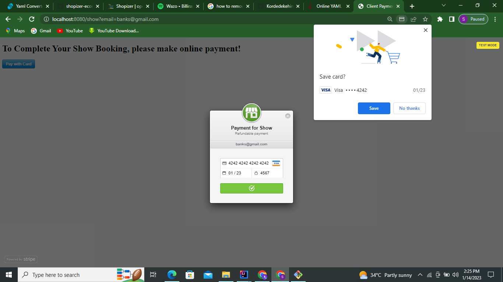
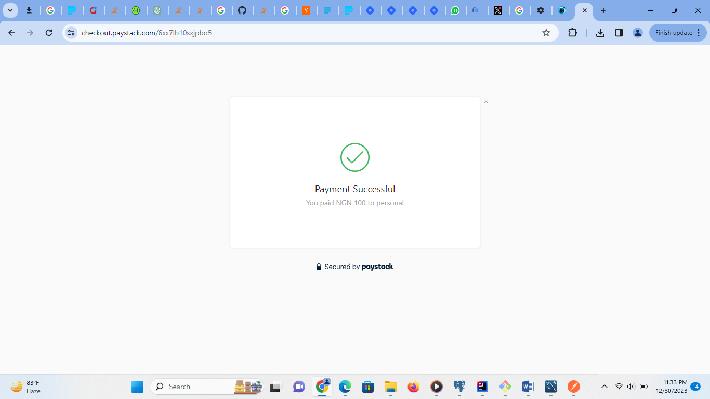

#A platform specifically for managers to manage artiste bookings and schedules and also engage the fans

Switch from Stripe to Paystack

# **Software Engineering Documentation**

# **Introduction**

This software engineering documentation describes the design and architecture of a Manager Assistant Platform system for managing artiste bookings and schedules and also engage the fans . The system aims to efficiently manage both fans and artistes in a way that has never been possible for.  The system will handle various aspects such as Payment, User management, Blogging, Voting and real time interactions.

# **Requirements**

The following requirements have been identified for the Management Assistant system:

Java 17  version

### **USER MANAGEMENT**

The system supports the teacher authentication and authorization.

User should be authorized to book artiste by first initiating booking.

User act on Manager consent and make Payment with Paystack API on the platform

The system supports the User to verify payment and money stays with platform until artist finish performance

User can interact with all managers post by Liking, Commenting, Voting and so on.

### **MANAGER SYSTEM**

The system supports the manager authentication and authorization.

Manager is the only user authorizes to Post and moderate polls

Manager should consent when booking is initiated for their artistes before payment can be made

Manager posts the scheduled date of the artistes for bookings outside the platform to avoid clash with platform users booking

Manager will be credited after User consent to Payment after the initial booked date

### **MODE OF OPERANDI**

A SINGLE ARTISTE CAN NOT BE BOOKED TWICE ON THE SAME DATE. NEVER!

## **FLEXIBILITIES**

The app helps manager manage their artiste effectively

The app publicizes the artiste and help gets the attention of die hard fans

All Payment are held within the app and immediately paid after artiste satisfy the bookie

The Poll is specifically to get Fans opinions on show dates, ticket price, venues and so on.

# **Design Considerations**

## **Design Patterns**

To design the Management Assistant system, the following design patterns can be considered:

Factory Pattern: The Factory pattern can be used to create instances of users which includes the manager and the users. It allows for flexible object creation without specifying the exact class of the object that will be created.

Observer Pattern: The Observer pattern can be used to implement tracking and monitoring functionality. The artiste location and the schedules, such as users or administrators, who can receive updates about the current state of the artistes and bookings.

State Pattern: The State pattern can be applied to manage the state transitions of the Payments. Each payment can have different states (NO_PAYMENT_MADE,PENDING_PAYMENT,PAYMENT_CONFIRMED), and the State pattern helps in encapsulating the behavior associated with each state and managing the payments among users.

## **Software Architecture Design**

The BookStar system can be designed using a layered architecture, specifically the Model-View-Controller (MVC) pattern. This pattern separates the system into three major components:

Model: The Model component represents the data and business logic of the system. It includes classes such as Payment, Vote, Booking, Poll, Post responsible for managing the booking platform.

View: The View component handles the presentation and user interface of the system. It includes the user interfaces for creating, posting, payment, booking and attempting exercises.

Controller: The Controller component acts as an intermediary between the Model and View components. It receives user input from the View, performs necessary operations on the Model, and updates the View accordingly. It includes classes such as Booking Controller, Payment Controller, Management Controller and so on.

The layered architecture ensures separation of concerns and modularity, making the system easier to maintain and extend.

# ** RUN the app with followings: **

## ** RUN THE APP **

## ** mvn spring-boot:run **

